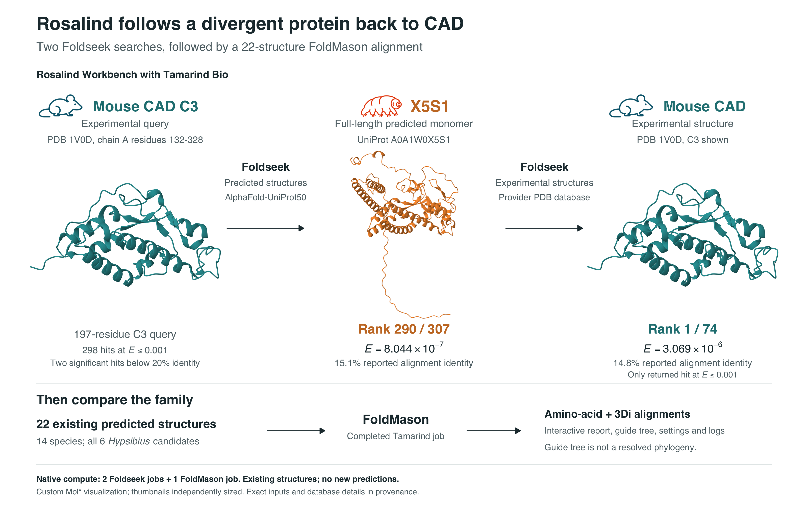
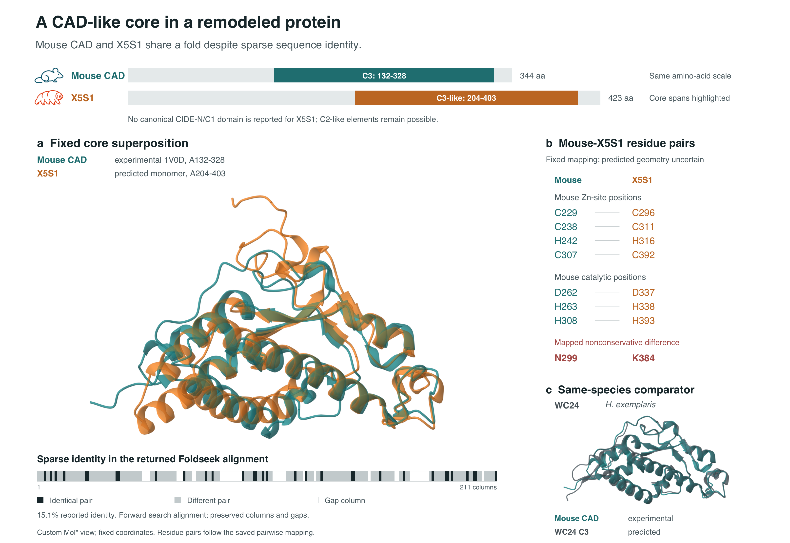
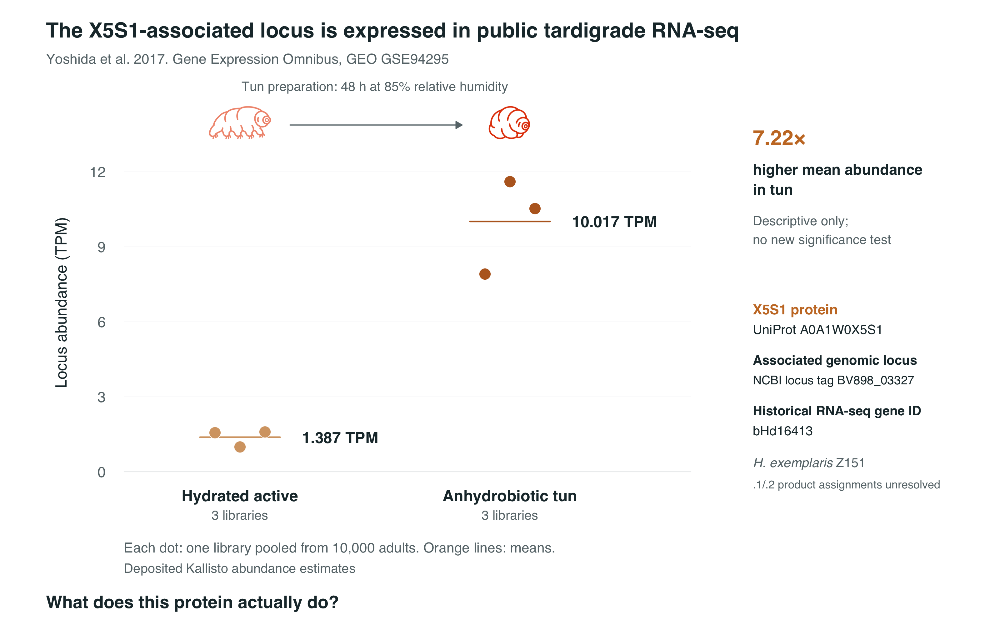

# Revisiting the apoptotic nuclease CAD with Rosalind Workbench

**Question:** What does the CAD/DFF family look like when revisited with current genome and predicted-structure databases?

**Main finding:** A fresh, guided structure-first analysis recovered X5S1 (A0A1W0X5S1), a highly divergent *Hypsibius exemplaris* protein without a CAD/DFF40 or CIDE-N annotation in the retrieved records. A reciprocal structural search returned experimental mouse CAD first. Deposited public RNA-seq shows a descriptive difference in abundance of the associated locus between active and desiccated tun states.

**Interpretation:** The combined evidence supports a deeply remodeled CAD/DFF40-family **candidate**. Nuclease activity and physiological function remain experimentally untested. The candidate hypothesis predates this fresh reproduction.

## The three main figures

## Workflow

Experimental mouse CAD C3 → **Rosalind Workbench → Tamarind Bio → Foldseek** → X5S1 → reciprocal Foldseek against experimental structures → mouse CAD → **FoldMason family-scale structural context** → current genome, literature and deposited RNA-seq checks → testable biological hypothesis.

[Workflow figure](figures/WORKFLOW_PROVENANCE.png) · [12-second real Mol* animation](animation/mouse_x5s1_12s_rock.gif)

| Contribution | What actually ran |
|---|---|
| Fresh connected computation | Two native Tamarind Foldseek jobs and one native FoldMason job |
| Interactive inspection | Molecular Structure Viewer and Sequence & Alignment Viewer, recorded separately from computation |
| Public data retrieval | PDB, AlphaFold DB, UniProt/InterPro, NCBI and GEO; later successful Life Sciences Databases helper operations distinguished from ordinary retrieval |
| Local supporting analysis | MMseqs2 sequence comparison, deposited-CDS verification and processed-expression calculations |
| Figure production | R composition and custom Mol* renders of real preserved coordinates; main figures/GIF are not native Workbench screenshots |

## Results at a glance

| Evidence | Saved result |
|---|---|
| Forward Foldseek | 307 returned; 298 at E ≤ 0.001; X5S1 provider rank 290; E = 8.044 × 10^-7; 15.1% reported aligned identity |
| Reciprocal Foldseek | 74 returned; mouse 1V0D rank 1; E = 3.069 × 10^-6; 14.8% identity; only hit at E ≤ 0.001 |
| FoldMason | 22 existing structures from 14 species; alignment context, not a resolved phylogeny |
| Expression | 1.387 TPM active and 10.017 TPM tun; 7.22-fold ratio, descriptive only |

The forward database is clustered `alphafold-uniprot50`; exact accession absence may reflect clustering. The reciprocal provider database is `pdb`; equivalence to historical PDB100 is not established. Database snapshot dates were not disclosed. The reciprocal searches do not form a strict reciprocal-best-hit pair.

## Inspect the evidence

- [Complete forward table](analysis/foldseek/forward_afdb50/aln.csv) and [complete reciprocal table](analysis/foldseek/reciprocal_pdb/aln.csv).
- [Native FoldMason amino-acid alignment](analysis/foldmason/native/result.fasta_aa.fa), [3Di alignment](analysis/foldmason/native/result.fasta_3di.fa), [guide tree](analysis/foldmason/native/result.fasta.nw), and [22-model manifest](analysis/foldmason/provenance/INPUT_MANIFEST.json).
- [Sequence control](analysis/sequence/README.md), [expression cohort and inputs](analysis/expression/README.md), and [locus audit](analysis/locus/README.md).
- [Methods and limitations](docs/METHODS_AND_LIMITATIONS.md), [claims and caveats](docs/CLAIMS_AND_CAVEATS.md), [provenance ledger](provenance/PROVENANCE_LEDGER.md), and [actual tool pipeline](provenance/WORKBENCH_PIPELINE.md).
- [Reproduction instructions](code/README.md), [file checksums](provenance/VERSION_MANIFEST.tsv), and [data/rights notes](LICENSE_OR_DATA_NOTES.md).

This is a curated review copy prepared for public sharing with Jan's authorization. The original workspace, earlier figures, specialist phylogeny work and immutable viewer remain preserved separately. This compact repository does not supersede that broader archive. No new searches, predictions or raw-read reanalysis were performed for this handoff.
